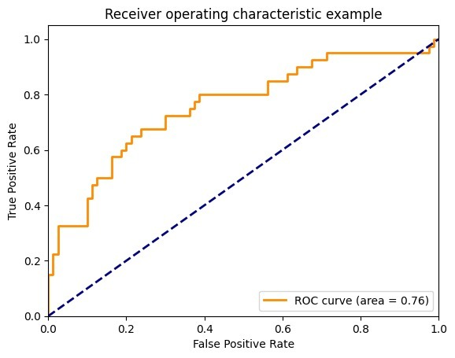

# Optimizing Convolutional Neural Network for Image Classification Using Random Search: Impact Analysis on Accuracy, Precision, Recall, and F1-Score

## Link of Google Collab
### Hyper-Parameter tuning
https://colab.research.google.com/drive/1uGex6ucYeS-zwnJDqzQjQs-jn4h1-BfY?usp=sharing
### Image Classification
https://colab.research.google.com/drive/1C4-u-qY-tu1gJQc8yvXjII6C4ATPK0On?usp=sharing
## Dataset Link
https://onedrive.live.com/?authkey=%21AG6NeP2ZJSQocMs&id=38523F73D2FC2EFF%21264905&cid=38523F73D2FC2EFF&parId=root&parQt=sharedby&o=OneUp
## Methodology
Methodology: Convolutional Neural Network and fine tuning through random search
## Accuracy: 99%

 
**Figure:** ROC-curve.
## Results Analysis
The ROC curve analysis reveals promising results for the model's performance. With an AUC of 0.76, the model demonstrates a strong ability to distinguish between positive and negative cases. The curve's trajectory towards the top-left corner indicates a good balance between sensitivity and specificity. These findings suggest that the model has the potential to make accurate predictions and can be a valuable tool in decision-making processes.

